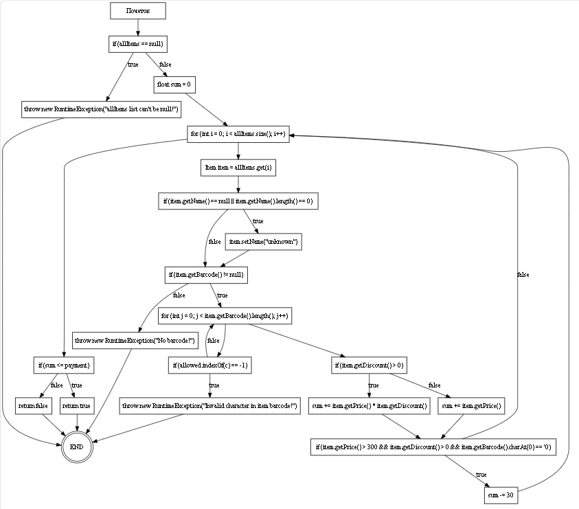

Име и Презиме: Марко Кунгуловски

Број на индекс: 203178

Барање 2: Control Flow Graph

 

Барање 3: Цикломатска комплексност

Цикломатската комплексност на дадениот код е 10. Пресметана е со формулата V(G) = E - N + 2, каде што E е бројот на ребра, а N е бројот на јазли. Може и со формулата V(G) = B +1 каде B е бројот на бинарни одлуки(if, for, while...).

Барање 4: Тест случаи според Every Branch критериумот

Барање 5: Тест случаи според Multiple Condition критериумот